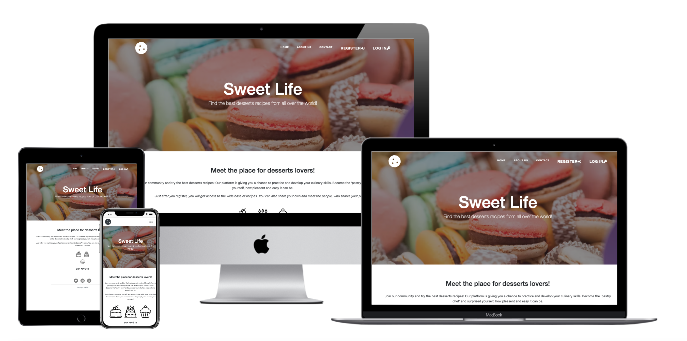
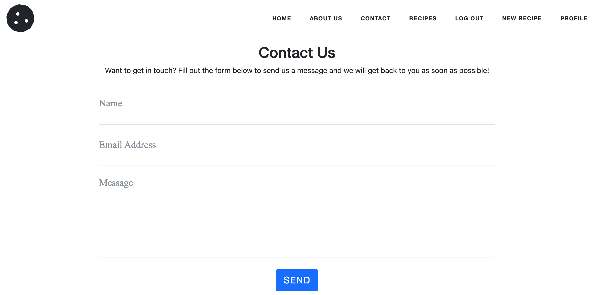
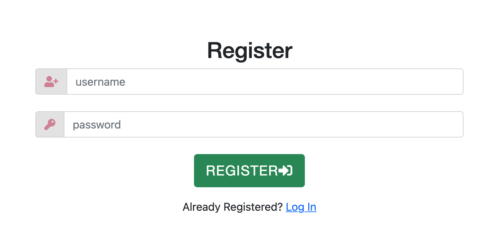
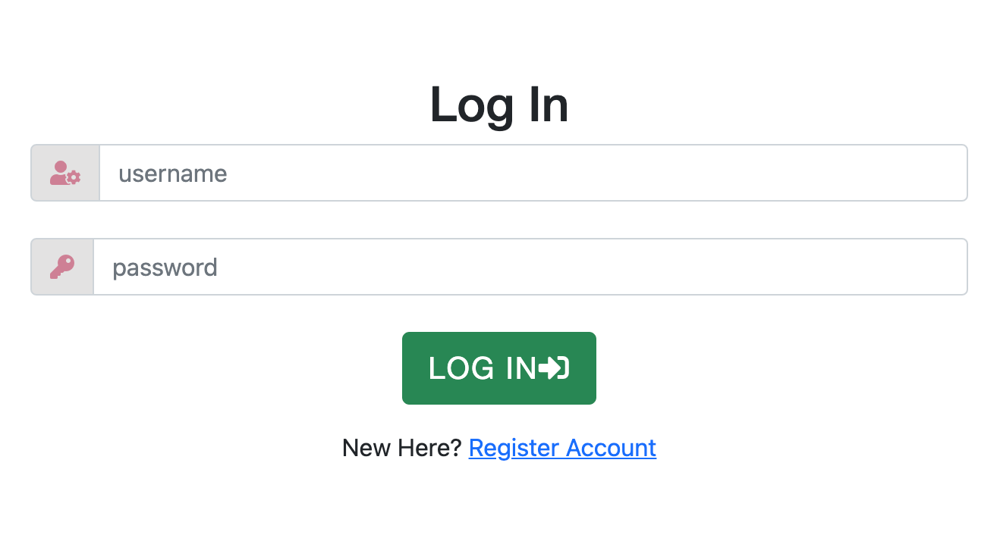
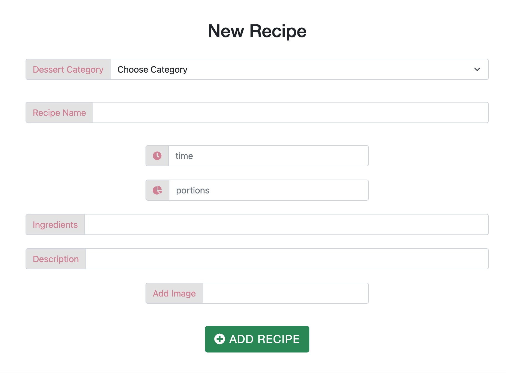
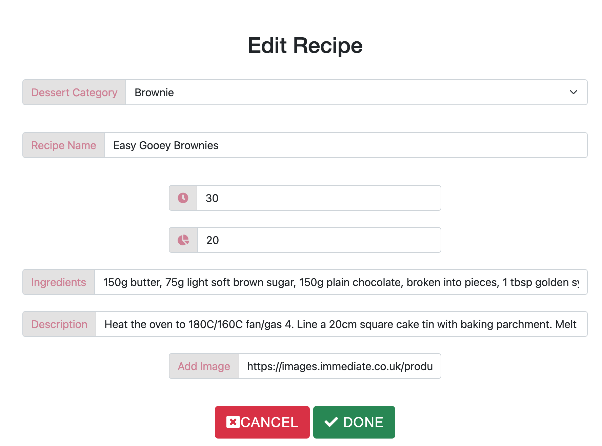
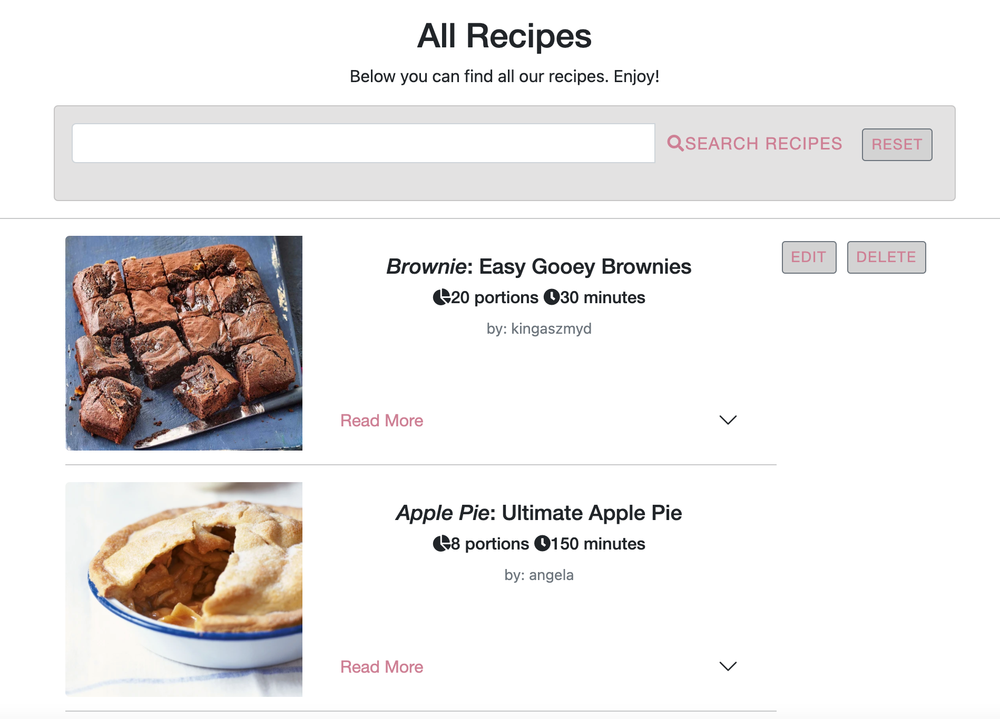
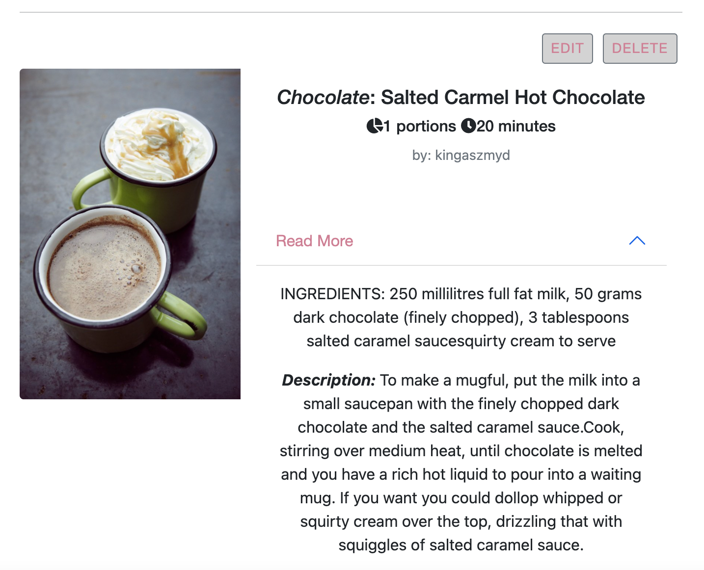

# Sweet Life
[View life project here](https://msp3-sweet-life.herokuapp.com/)

This project was created for the community of people, who adores the desserts and would like to share their recipes through this platform.
The project is dedicated to amateur ‘pastry chefs’ and all the people passionate aboute the cooking. The website is a space for sharing the recipes and for trying available ones. 
This platform is giving the possibilities of managing ecipes by creating them, displaying, updating and deleting. All the new recipes are available for the community members, who have created their accounts. 

## User stories
### First Time Visitor Goals
1. *As a First Time Visitor*, I want to easily understand the main purpose of the site and join the group of people sharing the recipes. I would like to try available recipes and share my own. 
2. *As a First Time Visitor*, I want to be able to easily navigate throughout the site to register my account and join the community.
### Returning Visitor Goals
1. *As a Returning Visitor*, I want to be able easily log in to my account and be able to create, edit or delete my recipes and be able to explore the base with recipes. 
2. *As a Returning Visitor*, I want to find the best way to get in contact with the community with any questions I may have.
### Frequent User Goals
1. *As a Frequent User*, I want to check to see if there are any newly added recipes.
2. *As a Frequent User*, I want to check to see if there are any new options and updates of the website, for example forums or newsletter I can sign up to. 
## Design
### Colour Scheme
The main colours used are: lightgray, darkgray, white and #D18195.
### Typography
* The StudioBootstrap - [View](https://startbootstrap.com/theme/clean-blog)
### Imagery
Imagery is important. The large, background hero image is used to be striking and catch the user's attention. 
## Wireframes
* Home Page Wireframe - [View](https://github.com/KingaSzmyd/MSP3-SweetLife/blob/main/static/img/wireframes/SweetLife_Main.jpg)
* Tablet Wireframe - [View](https://github.com/KingaSzmyd/MSP3-SweetLife/blob/main/static/img/wireframes/SweetLife_IpadMain.jpg)
* Mobile Wireframe - [View](https://github.com/KingaSzmyd/MSP3-SweetLife/blob/main/static/img/wireframes/SweetLife_IphoneMain.jpg)
## Features
The Sweet Life is the desserts recipes platform. The users need to register on the website giving their username and password to get access to their account. From their accounts they can see the recipes added by other users. They can also create they own recipes, adding them to base and editing or deleting them in anytime. If the users have any concerns or questions, they can use the email form to contact with the administrator.
There is also search bar helping to find the recipe in easy and fast way. 
* Responsive on all device sizes
* Interactive elements
### Existing Features
#### Navigation Bar
* Featured on all pages, the full responsive navigation bar includes links to the Home page, About us, Contact and Register/Log In pages and is identical in each page to allow for easy navigation. 
* This section will allow the user to easily navigate from page to page across all devices without having to revert back to the previous page via the ‘back’ button.
#### The Home Page
* This section introduces the user to Sweet Life with an eye catching image and description of the peoject. 
#### About Us Page 
* About Us page introduce users to the persons sanding behind the project. 
#### Contact Page
* This section will allow the user to refill the form and send an email to the administrator of the webpage. 

#### The Footer
* The footer section includes links to the relevant social media sites. The links will open to a new tab to allow easy navigation for the user. Footer is identical in each page to allow for easy navigation.
* The footer is valuable to the user as it encourages them to keep connected via social media.
#### Register 
* This active button allows user to create an account and join the community.

#### Log In 
* This active button allows user to easy get access to own account. 

#### Profile
* This is the website displaying after registration and log in, giving to the user information that the registration/log in process was successful.
#### New Recipe
* This page contains a form, that allows users to add the new recipe on the website.

#### Log Out
* After one click user can safetly log out from the account.
#### Edit Recipe and Delete Recipe
* These two options allow users to mange their own content, by editing and updating the recipe or deleting it.

#### Recipes
* This page displays all added recipes.

### Features Left to Implement
* Forum 
* Possibility to commenting recipes
* Another feature idea
## Technologies Used
### Languages Used
* [HTML5](https://en.wikipedia.org/wiki/HTML5)
* [CSS3](https://en.wikipedia.org/wiki/CSS)
* [JavaScript](https://en.wikipedia.org/wiki/JavaScript)
* [Python](https://en.wikipedia.org/wiki/Python_(programming_language))
### Frameworks, Libraries & Programs Used
1. [Bootstrap 5.1.1](https://getbootstrap.com/):
* Bootstrap was used to assist with the responsiveness and styling of the website.
2. [StartBootstrap](https://startbootstrap.com/theme/clean-blog):
* StudioBoostrap was used to create the navbar, hero image and footer.
3.	[JSON](https://en.wikipedia.org/wiki/JSON):
* JSON was used to create a data format.
4.	[Font Awesome](https://fontawesome.com/):
* Font Awesome was used on all pages throughout the website to add icons for aesthetic and UX purposes.
5.	[jQuery](https://jquery.com/):
* jQuery came with Bootstrap to make the elements responsive.
6.	[Git](https://www.gitpod.io/):
* Git was used for version control by utilizing the Gitpod terminal to commit to Git and Push to GitHub.
7.	[GitHub](https://github.com/):
* GitHub is used to store the projects code after being pushed from Git.
8.	[MongoDB](https://www.mongodb.com/):
* MongoDB was used to create a database.
9.	[Balsamiq](https://balsamiq.com/):
* Balsamiq was used to create the wireframes during the design process.
10.	[Techsini.com](https://techsini.com/):
* Multi Device Website Mockup Generator that helps with creating mockups of the website and allows to check its responsivness at different devices.
11. [Flask](https://en.wikipedia.org/wiki/Flask_(web_framework)):
* Flask was used to create the project app in the Python.
12. [Heroku](https://www.heroku.com/):
* Heroku was used to deploy the project.
## Testing
1.  Browsers:
* [Google Chrome](https://msp3-sweet-life.herokuapp.com/)
* [Safari](https://msp3-sweet-life.herokuapp.com)
2. Devices:  
* The website was viewed on a variety of devices such as Desktop, Laptop, iPhone7/8, iPhone 11 & iPhoneX.
* A large amount of testing was done to ensure that all pages were linking correctly.
3. Other: 
* Friends and family members were asked to review the site, set up their accounts and add recipes to point out any bugs and/or user experience issues and check the funcionality of the page.
4. Bugs:
* HTML:
In the Add Recipe and Edit Recipe form the <textarea> has to be replace by <input> placeholder.
* CSS:
The buggs occures with the Bootstrap and Start Bootstrap template concern: img-thumbnail, navbar, footer and forms. They were detected after using the Developer Tools from Google Chrome and overwrite by the !important command in css stylesheet.
#### Case 1 - images
`.img-thumbnail {
    padding: 0 !important;
    display: inline-block !important;
    border: 0 !important;
    width: 25% !important;
    margin: 10px !important;
}`
#### Case 2 - navbar
`.btn-link {
    font-size: large !important;
}`

`.fa-bars {
    color: white;
    font-size: large;
}`
#### Case 3 - footer
`.fa-stack {
    color: gray !important;
}`
#### Case 4 - forms
`.btn-outline-link {
    color: #D18195 !important;
}`

`.input-group-text {
    background-color: #E3E2E2  !important;
    color: #D18195 !important;
}`

`.card {
    background-color: #E3E2E2  !important;
}`

`#time,
#portions {
    display: inline-block !important;
}`
### Unfixed Bugs
The required attribute in contact form is not working.
## Validator Testing
The W3C Markup Validator, W3C CSS Validator Services, JSHint ... were used to validate every page of the project to ensure there were no syntax errors in the project.
* HTML
No errors were returned when passing through the official W3C validator
* CSS
No errors were found when passing through the official (Jigsaw) validator - [View](https://jigsaw.w3.org/css-validator/validator)
* JavaScript - [View](https://jshint.com/)
* Python - [Viev](https://extendsclass.com/python-tester.html)
No errors were found when passing through the [Extendsclass.com](https://extendsclass.com/python-tester.html) validator
## Testing User Stories from User Experience (UX) Section
### First Time Visitor Goals: 
1. *As a First Time Visitor*, I want to easily understand the main purpose of the site and learn more about the community.
Upon entering the site, users are automatically greeted with a clean and easily readable navigation bar to go to the page of their choice. 
2. *As a First Time Visitor*, I want to be able to easily be able to navigate throughout the site to find content.
The site has been designed to be fluid and never to entrap the user. At the top of each page there is a clean navigation bar, each link describes what the page they will end up at clearly.
On the Contact Us Page, after a form response is submitted, the page refreshes and the user is brought to the top of the page where the navigation bar is.
The user can also scroll to the bottom of any page on the site to locate social media links in the footer.
### Returning Visitor Goals:
1. *As a Returning Visitor*, I want to find the new recipes. These are clearly shown in the recipes page.
2. *As a Returning Visitor*, I want to find the best way to get in contact with the community with any questions I may have.
- The navigation bar clearly highlights the "Register" and "Log In" Pages.
- Here they can fill out the forms on the page.
- The footer contains links to the community Facebook, Twitter and Instagram page.
- Whichever link they click, it will be open up in a new tab to ensure the user can easily get back to the website.
### Frequent User Goals:
1. *As a Frequent User*, I want to check to see if there are any newly added recipes. The user would already be comfortable with the website layout and can easily log in to its account.
## Deployment
### GitHub Pages
The project was deployed to Heroku using the following steps:
1. Log in to [Heroku](https://dashboard.heroku.com) account.
2. Use Heroku (Web) UI to Deploy the Application.
3. Choose the deployment method GitHub.
4. Connect to GitHub by searching for the right repository.
5. Click "Enable Automatic Deploys" to ensure that any changes made on GitHub are automatically deployed on Heroku.
6. Deply the GitHub branch "main".
7. [Deployed Website](https://msp3-sweet-life.herokuapp.com/) 
## Credits
### Code 
* [Bootstrap](https://getbootstrap.com/) - liberies used through all pages to style elements: navigation bar, callout, buttons, cards and forms.
* [Code Institute-1](https://learn.codeinstitute.net/courses/course-v1:CodeInstitute+DCP101+2017_T3/courseware/ec081e87b3ea48ef986a7bd33f66e3b2/227076cacf094ba6aa17a6874d7c8fa0/?child=first) - learning materials from the course, how to build Flask app.
* [Code Institute-2](https://learn.codeinstitute.net/courses/course-v1:CodeInstitute+DCP101+2017_T3/courseware/9e2f12f5584e48acb3c29e9b0d7cc4fe/054c3813e82e4195b5a4d8cd8a99ebaa/) - learning materials from the course, how to build application with Mongo database and how to perform CRUD calls. 
* [Startbootstrap](https://startbootstrap.com/theme/clean-blog) - template used to create the background image with navbar and footer.
### Content
* [Wikipedia](https://www.wikipedia.org/)
* [Nigella.com](https://www.nigella.com/)  
* [BBC Good Food](https://www.bbcgoodfood.com/)
* [Font Awsome](https://fontawesome.com/)
### Media
* [Unsplash](https://unsplash.com/)
* [Nigella.com](https://www.nigella.com/) 
* [BBC Good Food](https://www.bbcgoodfood.com/)

## Acknowledgements
Anthony Ugwu, my mentor, and Tutor team for helpful suggestions and constructive feedback.

 

