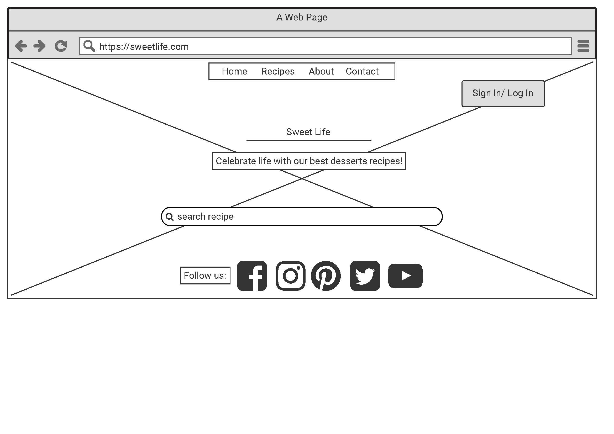
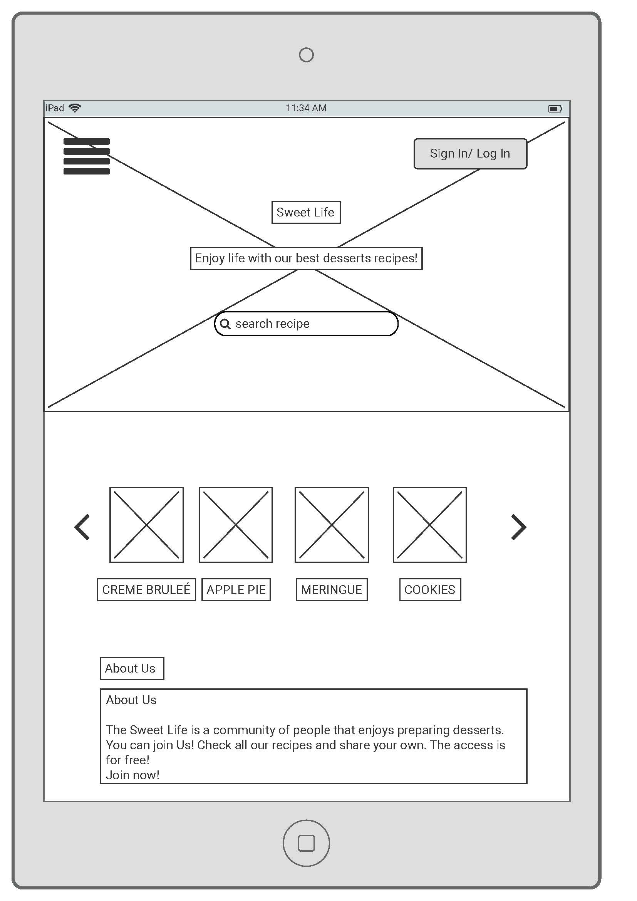
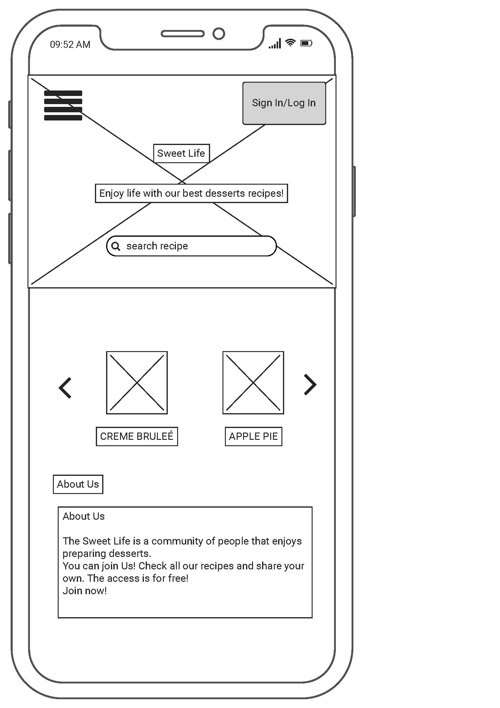

# Sweet Life

This project was created for the community of people, who adores the desserts and would like to share their recipes through this platform.
The project is dedicated to amateur ‘pastry chefs’ and all the people passionate aboute the cooking. The website is a space for sharing the recipes and for trying available ones. 
This platform is giving the possibilities of managing ecipes by creating them, displaying, updating and deleting. All the new recipes are available for the community members, who have created their accounts. 

## User stories

### First Time Visitor Goals
- As a First Time Visitor, I want to easily understand the main purpose of the site and join the group of people sharing the recipes. I would like to try available recipes and share my own. 
- As a First Time Visitor, I want to be able to easily navigate throughout the site to register my account and join the community.
### Returning Visitor Goals
- As a Returning Visitor, I want to be able easily log in to my account and be able to create, edit or delete my recipes and be able to explore the base with recipes. 
- As a Returning Visitor, I want to find the best way to get in contact with the community with any questions I may have.
### Frequent User Goals
- As a Frequent User, I want to check to see if there are any newly added recipes.
- As a Frequent User, I want to check to see if there are any new options and updates of the website, for example forums or newsletter I can sign up to. 
## Design
### Colour Scheme
The main colours used are: lightgray, darkgray, white and #D18195.
### Typography
* The StudioBootstrap - [View](https://startbootstrap.com/theme/clean-blog)
### Imagery
Imagery is important. The large, background hero image is used to be striking and catch the user's attention. 
## Wireframes
* Home Page Wireframe - 
* Tablet Wireframe - 
* Mobile Wireframe - 
## Features
The Sweet Life is the desserts recipes platform. The users need to register on the website giving their username and password to get access to their account. From their accounts they can see the recipes added by other users. They can also create they own recipes, adding them to base and editing or deleting them in anytime. If the users have any concerns or questions, they can use the email form to contact with the administrator.
There is also search bar helping to find the recipe in easy and fast way. 
* Responsive on all device sizes
* Interactive elements
### Existing Features
* Navigation Bar
- Featured on all pages, the full responsive navigation bar includes links to the Home page, About us, Contact and Register/Log In pages and is identical in each page to allow for easy navigation. 
- This section will allow the user to easily navigate from page to page across all devices without having to revert back to the previous page via the ‘back’ button.
* The landing page image
- The landing includes a photograph with text overlay to allow the user to see exactly which location this site would be applicable to.
- This section introduces the user to Sweet Life with an eye catching image and search bar allowing to find recipe. 
* About Us Page 
- About Us page introduce to the user the people sanding under the project. 
* Contact
- This section will allow the user to refill the form and send an email to the administrator of the webpage. 
* The Footer
- The footer section includes links to the relevant social media sites. The links will open to a new tab to allow easy navigation for the user. Footer is identical in each page to allow for easy navigation.
- The footer is valuable to the user as it encourages them to keep connected via social media.
* Register 
- This active button allows user to create an account and join the community.
* Log In 
- This active button allows user to easy get access to own account. 
* New Recipe
- This page contains a form, that allows users to add the new recipe on the website.
* Profile
- This is the website displaying after registration and log in.
* Log Out
- After one click user can safetly log out from the account.
* Edit Recipe and Delete Recipe
- These two options allows users to mange their own content.
### Features Left to Implement
* Forum 
* Possibility to commenting recipes
* Another feature idea
## Technologies Used
### Languages Used
* [HTML5](https://en.wikipedia.org/wiki/HTML5)
* [CSS3](https://en.wikipedia.org/wiki/CSS)
* [JavaScript](https://en.wikipedia.org/wiki/JavaScript)
* [Python](https://en.wikipedia.org/wiki/Python_(programming_language))

 

